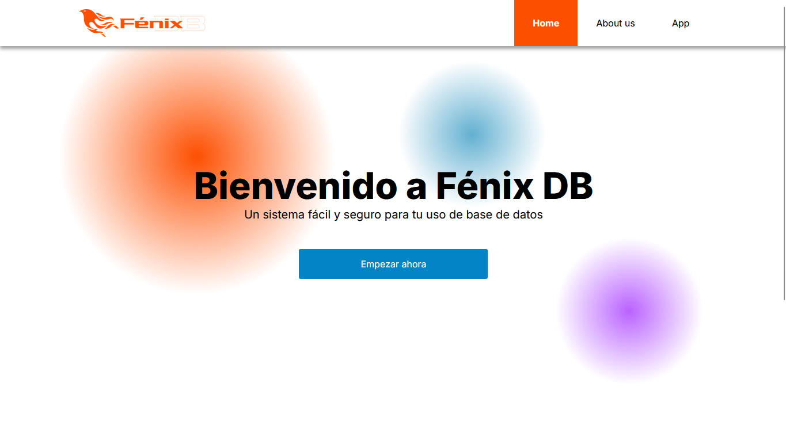

# Sistema Gestor de Base de Datos

Este es un proyecto para la clase de Aplicaciones Web del profesor René Santos Osorio,
para la Universidad Tecnológica de San Juan del Río.

## Tecnologías Utilizadas

* **MySQL** como base de datos
* **EJS** para el maquetado de la página
* **Express** para el desarrollo del backend
* **HTML** y **CSS** para el desarrollo del frontend
* **JavaScript** para la programación de todo el sistema
* **Git** y **GitHub** para la gestión del trabajo en equipo

## Características

* CRUD de bases de datos \
  Desde la ruta `/databases`, uno puede visualizar una lista en el lado izquierdo que indica las bases de datos
  presentes en el sistema; de ser necesario, se puede dar clic en el link con el texto "Crear base de datos"
  para inicializar una base de datos vacía (es decir, sin tablas) con un nombre por defecto, o dar clic en una
  base de datos existente para visualizar sus características y las tablas que contiene. 
  
  El nombre de las bases de datos se puede cambiar con tan solo editar la caja de texto que contiene su nombre, y se puede eliminar con el botón de "Eliminar base de datos" en color rojo dentro de la ruta de visualización de la BD.

* CRUD de tablas dentro de una base de datos \
  Dentro de la ruta de visualización de una BD particular aparece una lista con las tablas que contiene, así como
  un botón que redirige a un formulario para crear una nueva tabla. A las tablas ya creadas se les puede dar clic
  para dirigirse a una ruta que muestra sus características; desde ahí, es posible editar el nombre de las columnas
  de la tabla, añadir o quitar columnas, e incluso eliminar la propia tabla. Por el momento, no es posible cambiar
  el nombre de la tabla en sí misma, pero se tiene planeado implementar esa funcionalidad a futuro.

* CRUD de registros dentro de una tabla \
  Al visualizar una tabla, existe un botón que despliega un formulario para insertar registros siguiendo el
  esquema correspondiente; dichos registros se recuperan en una sección posterior dentro de la
  ruta de visualización de la tabla, y desde ahí se pueden editar o eliminar según los botones correspondientes.

## Integrantes

El equipo desarrollador está compuesto por tres integrantes:

- Edgar Trejo Avila
- César Eduardo Estrada Fragoso
- Francisco Arturo Munguía López

Actualmente, los tres somos compañeros de clase en la universidad; nos encontramos estudiando la ingeniería
de Desarrollo y Gestión de Software y decidimos juntarnos para terminar este proyecto, casi el último del
que tenemos que preocuparnos en el cuatrimestre que vamos cursando (nuestra universidad lleva un plan
basado en cuatrimestres).

